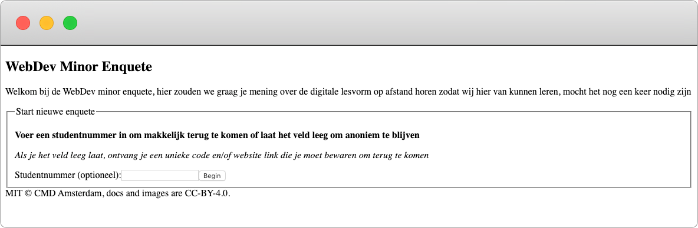
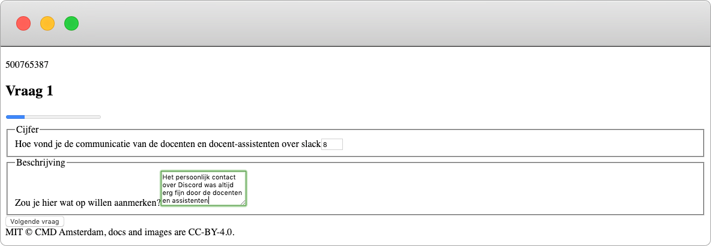
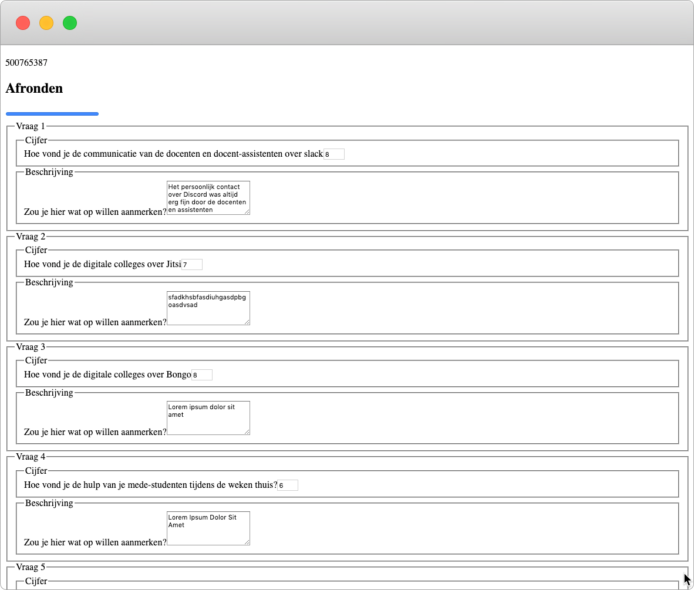
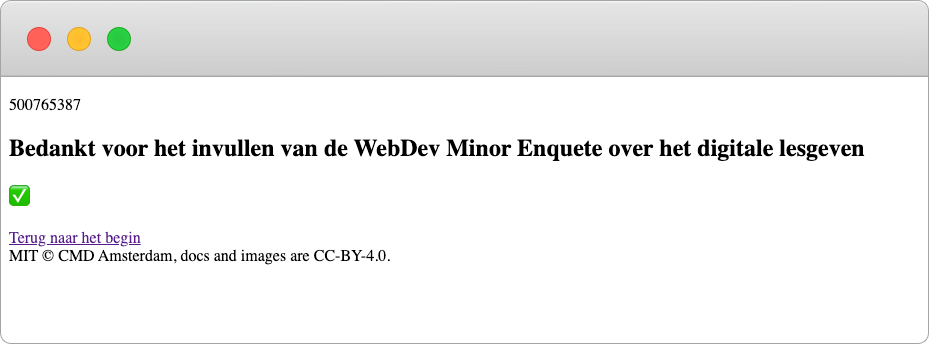
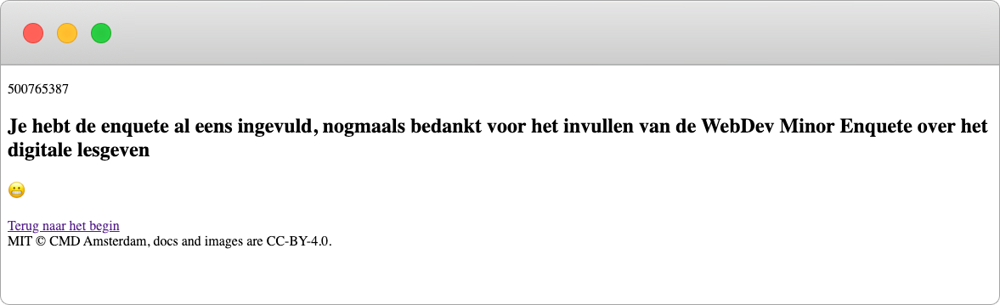

### [Live Demo](https://browsertech1920.herokuapp.com)
# Browser Technologies @cmda-minor-web 1920

    
In deze repo houd ik de opdrachten en onderzoek bij voor mijn persoonlijke ontwikkeling met browser technologies.    
## Inhoudsopgave
- [Leerdoelen](#leerdoelen)
- [Progressive enhancement case](#progressive-enhancement-case)
- [Opdrachten](#opdrachten)
    * [Week 1](#week-1)
    * [Week 2](#week-2)

## Leerdoelen
- _Wat is Progressive enhancement en hoe kun je dit toepassen._
- _Hoe doe je Feature Detection en wat doe je als een techniek niet werkt of wordt ondersteund._
- _Leren een Browser Technologies onderzoeken, testen en implementeren als enhancement._

[Rubric](https://docs.google.com/spreadsheets/d/1MV3BWwwg_Zz1n-S_qOM4iSm4gA4M6g0xAxGacyaPuac/edit?usp=sharing)

## Progressive enhancement case
Om de nieuwe kennis toe te passen en behaalde leerdoelen te onderbouwen, behandel ik in deze repo een case die vraagt om 
een sterke vorm van progressive enhancement. In het algemeen betekend dit dat de website in zijn simpelste vorm, met alleen HTML,
op bijna elke browser zijn kern functionaliteit kan uitvoeren.
### De case
De case waar ik voor gekozen heb luidt als volgt:   

__Ik wil een enquete kunnen invullen over de minor Web Development, met verschillende antwoord mogelijkheden. Als ik de enquete niet afkrijg, wil ik later weer verder gaan met waar ik ben gebleven.__   

Deze case lijkt mij perfect om te leren over progressive enhancement, aangezien formulieren op het web een onderdeel is waar
heel vaak een beetje op wordt "gecheat". Vaak worden Javascript en/of andere nieuwe technieken gebruikt om de invulling van
een formulier af te handelen en dit zo makkelijk mogelijk te maken voor de gebruijker. Het probleem hierbij is dat lang niet 
iedereen diezelfde ervaring zo ervaart als dat hij ontworpen is. De manier zoals het eigenlijk hoort, met semantische HTML en
correcte server afhandeling is lang niet bij iedereen meer bekend. Daarom wilde ik het juist eens op die manier opbouwen
en daarna de extra laag eroverheen gieten.

### De functionele laag
1. Login met een studentennummer

2. Vul de vragen in
    * Het is mogelijk om terug te gaan of later terug te komen door het stapsgewijs invullen te koppelen aan een studentnummer `(uuid)`

3. Bekijk je antwoorden een laatste keer

4. Bedankt bericht voor het invullen

5. Je kan het niet nog een keer invullen

#### Hoe werkt het
Om de functionele laag werkend te krijgen heb ik alle logica voor dit formulier op een node (express) server afgehandeld en schrijf
ik de data weg naar een MongDB (Database). Elke keer dat er een stap wordt gezet wordt er een post request gemaakt naar de server,
wordt de data geüpdatet in de database en wordt er een nieuwe pagina gerenderd op basis van de data die er eventueel al in stond.

#### Feedback
Ik zou graag feedback willen ontvangen op
- Manieren om te enhancen los van service worker, local storage en AJAX calls
- UX/flow van de app
- Verschillende input velden
- Semantische HTML
- Feedback die de gebruiker ontvangt

## Opdrachten
### Week 1
- [x] [Opdracht 1.1](./onderzoek/breekHetWeb.md)
>    Opdracht 1.1 heb ik gedaan met de features
>    - Geen Javascript
>    - Geen muis/trackpad
- [x] [Opdracht 1.2](./onderzoek/devices.md)
>    Opdracht 2.2 heb ik gedeeltelijk op zowel mijn OBA als WAFS app gedaan, aangezien mijn OBA app vrij weinig content heeft en vooral een proof of concept is (veel Javascript) dus het werkte eigenlijk sws al op geen ander manier als lokaal op mijn laptop
>   - QP Revolution
>   - Ipod Touch 4G
>   - Ipad Air 2

### Week 2
- [x] [Opdracht 2](./onderzoek/peOpdracht.md)
>    Use case om een enquete data te laten onthouden progressive enhanced
>    - Wireflows

<!--
### Week 2
Wat laat je zien als een browser of gebruiker een 'enhancement' niet kan tonen of zien? Hoe doe je Feature Detection en wat doe je als een techniek niet werkt of wordt ondersteund? [Planning week 2](./slides/Week2.png)

#### Woensdag
- [Les 3 - Over Feature detect & Briefing opdracht 2]()
- [Opdracht 2 - Progressive Enhanced Browser Technologie](Opdracht2.md)

Deze les gaan we onderstaande artikelen bespreken:
- [HTML: The Inaccessible Parts](https://daverupert.com/2020/02/html-the-inaccessible-parts/)
- [Accessibility Through Semantic HTML by Laura Kalbag](https://24ways.org/2017/accessibility-through-semantic-html/)

#### Weekly Nerd
PE bij de Voorhoede.

#### Donderdag
- [Les 4 - Over Browsers]()

Deze les gaan we onderstaande artikelen bespreken:
- [The accessibility mindset by Eric Eggert](https://24ways.org/2015/the-accessibility-mindset/)
- [The Role of Enhancement in Web Design by Raluca Budiu / Nielsen Norman Group](https://www.nngroup.com/articles/enhancement/)

#### Vrijdag
Code review en feedbackgesprekken opdracht 2.

### Week 3
Deze week werken we verder aan opdracht 2. [Planning week 3](./slides/Week3.png)

#### Woensdag
- [Les 5 - Over Notificaties]()

Deze les gaan we onderstaande artikelen bespreken:
- [Progressive Enhancement and Data Visualizations by Chris Coyier](https://css-tricks.com/progressive-enhancement-data-visualizations/)
- [Make the Web Work For Everyone by Justin Crawford, Chris Mills, Ali Spivak](https://hacks.mozilla.org/2016/07/make-the-web-work-for-everyone/)

#### Weekly Nerd
Op bezoek bij Bol.com

#### Donderdag
Verder werken aan opdracht 2

#### Vrijdag
Code review en beoordelingsgesprekken opdracht 2.
-->

<!-- Add a link to your live demo in Github Pages 🌐-->

<!-- ☝️ replace this description with a description of your own work -->

<!-- replace the code in the /docs folder with your own, so you can showcase your work with GitHub Pages 🌍 -->

<!-- Add a nice poster image here at the end of the week, showing off your shiny frontend 📸 -->

<!-- Maybe a table of contents here? 📚 -->

<!-- How about a section that describes how to install this project? 🤓 -->

<!-- ...but how does one use this project? What are its features 🤔 -->

<!-- Maybe a checklist of done stuff and stuff still on your wishlist? ✅ -->

<!-- How about a license here? 📜 (or is it a licence?) 🤷 -->
