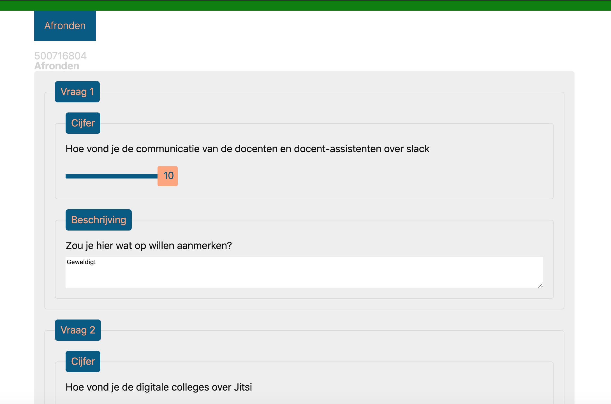
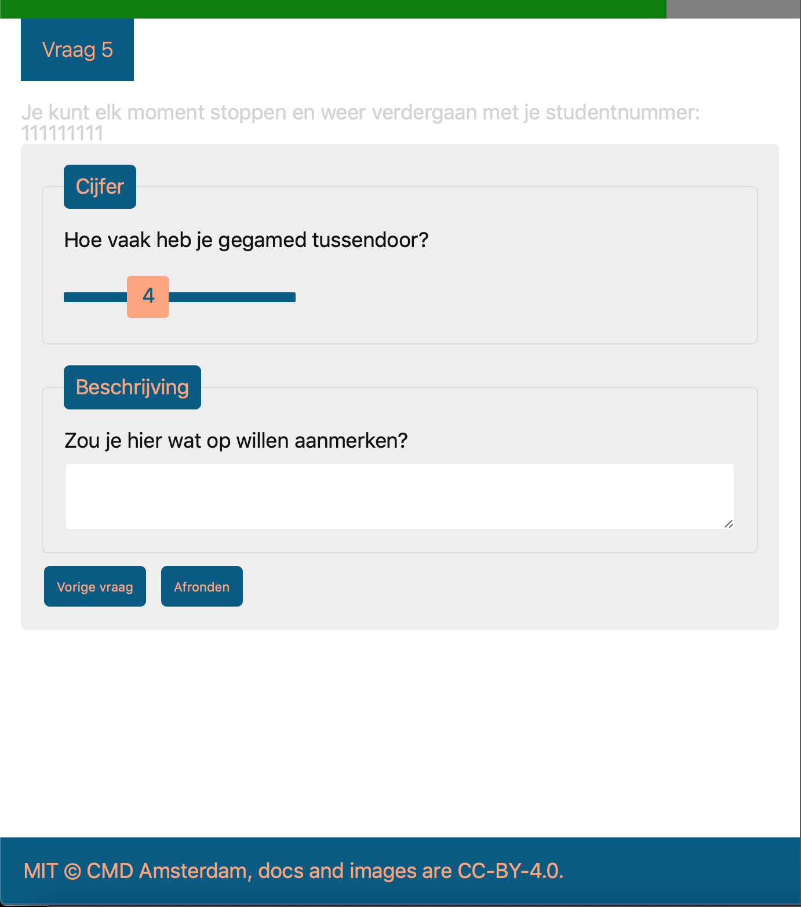

### [Live Demo](https://browsertech1920.herokuapp.com)
# Browser Technologies @cmda-minor-web 1920

    
In deze repo houd ik de opdrachten en onderzoek bij voor mijn persoonlijke ontwikkeling met browser technologies.    
## Inhoudsopgave
- [Leerdoelen](#leerdoelen)
- [Progressive enhancement case](#progressive-enhancement-case)
    * [De case](#de-case)
    * [De functionele laag](#de-functionele-laag)
        + [Hoe werkt het](#hoe-werkt-het)
    * [De Usable laag](#de-usable-laag)
    * [De pleasurable laag](#de-pleasurable-laag)
    * [Hoe werkt het](#hoe-werkt-het)
    * [Browsersupport](#browsersupport)
        + [Screenshots](#screenshots)
        + [Browser verschillen](#browser-verschillen)
- [Opdrachten](#opdrachten)
    * [Week 1](#week-1)
    * [Week 2](#week-2)

## Leerdoelen
- _Wat is Progressive enhancement en hoe kun je dit toepassen._
- _Hoe doe je Feature Detection en wat doe je als een techniek niet werkt of wordt ondersteund._
- _Leren een Browser Technologies onderzoeken, testen en implementeren als enhancement._

[Rubric](https://docs.google.com/spreadsheets/d/1MV3BWwwg_Zz1n-S_qOM4iSm4gA4M6g0xAxGacyaPuac/edit?usp=sharing)

## Progressive enhancement case
Om de nieuwe kennis toe te passen en behaalde leerdoelen te onderbouwen, behandel ik in deze repo een case die vraagt om 
een sterke vorm van progressive enhancement. In het algemeen betekend dit dat de website in zijn simpelste vorm, met alleen HTML,
op bijna elke browser zijn kern functionaliteit kan uitvoeren.
### De case
De case waar ik voor gekozen heb luidt als volgt:   

__Ik wil een enquete kunnen invullen over de minor Web Development, met verschillende antwoord mogelijkheden. Als ik de enquete niet afkrijg, wil ik later weer verder gaan met waar ik ben gebleven.__   

Deze case lijkt mij perfect om te leren over progressive enhancement, aangezien formulieren op het web een onderdeel is waar
heel vaak een beetje op wordt "gecheat". Vaak worden Javascript en/of andere nieuwe technieken gebruikt om de invulling van
een formulier af te handelen en dit zo makkelijk mogelijk te maken voor de gebruijker. Het probleem hierbij is dat lang niet 
iedereen diezelfde ervaring zo ervaart als dat hij ontworpen is. De manier zoals het eigenlijk hoort, met semantische HTML en
correcte server afhandeling is lang niet bij iedereen meer bekend. Daarom wilde ik het juist eens op die manier opbouwen
en daarna de extra laag eroverheen gieten.

### De functionele laag
1. Login met een studentennummer

2. Vul de vragen in
    * Het is mogelijk om terug te gaan of later terug te komen door het stapsgewijs invullen te koppelen aan een studentnummer `(uuid)`

3. Bekijk je antwoorden een laatste keer

4. Bedankt bericht voor het invullen

5. Je kan het niet nog een keer invullen

### De usable laag
Styling toegevoegd voor beter overzicht op index

En op de vragen

### De pleasurable laag
Op de pleasurable laag wordt gebruik gemaakt van de localstorage en AJAX om de pagina's te laden.
Voor de gebruiker is er weinig verschil in gebruik afgezien van een groot performance verschil.
Daarnaast hoeft de gebruiker niet opnieuw in te loggen om verder te gaan door de local storage.

De vragen worden progressive enhanced door Number input types om te zetten naar een range input

Er wordt extra form validatie toegevoegd die relevant is voor een range (een required is niet mogelijk op een range ivm dat er altijd een waarde is)

De overzicht pagina bevat alle eerder genoemde enhancement

#### Hoe werkt het
Om de functionele laag werkend te krijgen heb ik alle logica voor dit formulier op een node (express) server afgehandeld en schrijf
ik de data weg naar een MongDB (Database). Elke keer dat er een stap wordt gezet wordt er een post request gemaakt naar de server,
wordt de data geüpdatet in de database en wordt er een nieuwe pagina gerenderd op basis van de data die er eventueel al in stond.

### Browsersupport
#### Screenshots
##### Chrome (latest) ✅ Full

##### Firefox (latest) ✅ Full

##### Safari (latest) ✅ Full

##### IE11 ✅ Full (klein beetje gecheat met een fetch polyfill, maar wilde graag full support tot IE11)

##### Mobile Chrome (latest) ✅ Full

De range tooltip is hier standaard al naar beneden omdat het anders een hele nare UX heeft waarbij je eerst moet klikken.
Hiervoor wordt een globale variabele gezet wanneer er een touch wordt gedaan bij het eerste scherm.

#### Browser verschillen en Feature detectie
##### Volgende & Vorige knop in 1 formulier
Om het formulier progressive te enhancen wilde ik graag dat alle data per vraag opgeslagen werd op de server. Hiervoor
moest ik dus elke vraag in een los formulier zetten, maar wilde ik wel dat de gebruiker terug kon naar de vorige vraag.
Om dit op te lossen heb ik twee buttons onderaan het formulier gezet, zowel volgende als vorige, met een andere name.
Doordat deze name anders is, kan ik op de server zien met welke knop het formulier verstuurd is en dus afvangen welke pagina
er gerenderd moet worden. Bij de progressive enhancement wilde ik niet meer alle HTML pagina's door de server laten renderen, 
zodat de performance omhoog ging, de enquête ook offline werkte en de gebruiker gemakkelijk van de ene naar de andere vraag
kon springen. Het probleem wat ik hierbij tegenkwam, is dat het afvangen welke knop er geklikt wordt op een form submit event
niet bij elke browser op dezelfde manier wordt meegegeven. De makkelijke oplossing zou zijn om het click event af te vangen van de button,
maar dit brengt weer andere support issues met zich mee voor browsers met andere vormen van input. Daarnaast maakte dit de feature detectie lastiger want op submit
kan ik het normale evenement laten doorgaan als ik er niet alles tussen kan doen wat ik met Javascript wil doen.
Het probleem is dat er twee implementaties zijn van browsers die goed te illustreren zijn met Firefox en Chrome.
- Bij firefox is het element waardoor het event uitgevoerd wordt `event.explicitOriginalTarget`, maar bij chrome is dit niet beschikbaar.
- Bij Chrome kan je het huidige geklikte element ophalen door `document.activeElement.tagName` en als deze dus gelijk is aan de input `document.activeElement.tagName === 'INPUT'`,
 heb je een de geklikte button, maar bij firefox returnt hierbij het formulier.
Om dit op te lossen kijk ik dus eerst welke van de 2 een correct is en wordt daarmee de knop afgehandeld, als geen van beide beschikbaar is, wordt het normale event uitgevoerd
en wordt dus via de server bepaald welke pagina er geladen moet worden.

##### Range slider met waarde
Om een range element toe te voegen aan een pagina waarbij de waarde zichtbaar is, is javascript vereist. Om deze reden zit
er in de HTML geen range slider, maar een number input. Op deze manier is er altijd een duidelijke manier om een cijfer te geven met of zonder Javascript.
Het leek mij een interessante enhancement om de range slider toe te voegen zodra Javascript beschikbaar is, dus het number input wordt hierbij vervangen.
Ik had hier een leuke styling bij bedacht waarbij de waarde van de slider in de knop zit.    
    
Het probleem hiermee is, dat op mobiel de hover state niet af kan gaan voordat je de knop met je vinger vastpakt, waardoor je de knop niet kunt bewegen voordat je eerst een keer drukt.
Om dit op te lossen, kijk ik constant welke input er gebruikt wordt. Zodra de gebruiker een keer een touch event gebruikt,
verplaatst de label van de slider knop altijd naar beneden zodat ook mobiele gebruikers er makkelijk gebruik van kunnen maken.    
    

##### Form input styling
De uitleg voor dit verschil kan ik vrij kort houden, al is het werk wat er in gaat zitten onwijs groot.
Form input elementen hebben een standaard styling bij elke browser en elke browser handelt dit op zijn eigen manier af.
Hierdoor zijn er veel CSS-selectoren en pseudo-classes die specifiek voor 1 browser zijn en daarom moest ik sommige elementen wel 3x stylen,
met zowel -moz-, -ms- en -webkit- selectoren als pseudo-classes

#### Offline functionaliteit
Door de toevoeging van JavaScript kan alle benodigde data om de pagina's te renderen en content van de gebruikers op te slaan.
Offline betekend dit dat je nog steeds de hele enquete in kan vullen en alle pagina's kan bekijken.
Alle ingevulde data wordt gesynchroniseerd met de local storage waardoor alle data ook beschikbaar is als de gebruiker weggaat en later terug komt of offline gaat.
Door de serviceworker zijn er fallbacks voor requests die niet binnenkomen en kan data ook later verstuurd worden als een gebruiker offline is gegaan tijdens het invullen.
De gebruiker krijgt een melding zodra hij offline is, dat de data wel opgeslagen wordt en verstuurd wordt wanneer dat mogelijk is.
Al deze functionaliteiten hebben een feature detectie, dus de localstorage, service worker en fetch requests. Veel functionaliteiten hebben een fallback, dit is makkelijk te doen door de progressive enhancement.
De applicatie valt dan dus terug op de submit events.
__Let op:__ De fetch requests worden opgevangen voor oudere browsers door de Whatwg-fetch fetch polyfill van github zelf.
Fetch is niet in alle browsers beschikbaar, maar de promise based XHR requests zijn tegenwoordig niet meer weg te denken. Ik kan hiervoor
bekende promise oplossingen gebruiken met de XHR requests, maar dit gaat tenkoste van leesbaarheid en development tijd in mijn ogen.
Daarnaast ben ik bekend met wat fetch doet en hoe polyfills hiervoor werken, dus heb ik ervoor gekozen een polyfill te gebruiken omdat dit in mijn ogen de beste oplossing leek voor de usecase.

## Opdrachten
### Week 1
- [x] [Opdracht 1.1](./onderzoek/breekHetWeb.md)
>    Opdracht 1.1 heb ik gedaan met de features
>    - Geen Javascript
>    - Geen muis/trackpad
- [x] [Opdracht 1.2](./onderzoek/devices.md)
>    Opdracht 2.2 heb ik gedeeltelijk op zowel mijn OBA als WAFS app gedaan, aangezien mijn OBA app vrij weinig content heeft en vooral een proof of concept is (veel Javascript) dus het werkte eigenlijk sws al op geen ander manier als lokaal op mijn laptop
>   - QP Revolution
>   - Ipod Touch 4G
>   - Ipad Air 2

### Week 2
- [x] [Opdracht 2](./onderzoek/peOpdracht.md)
>    Use case om een enquete data te laten onthouden progressive enhanced
>    - Wireflows

<!--
### Week 2
Wat laat je zien als een browser of gebruiker een 'enhancement' niet kan tonen of zien? Hoe doe je Feature Detection en wat doe je als een techniek niet werkt of wordt ondersteund? [Planning week 2](./slides/Week2.png)

#### Woensdag
- [Les 3 - Over Feature detect & Briefing opdracht 2]()
- [Opdracht 2 - Progressive Enhanced Browser Technologie](Opdracht2.md)

Deze les gaan we onderstaande artikelen bespreken:
- [HTML: The Inaccessible Parts](https://daverupert.com/2020/02/html-the-inaccessible-parts/)
- [Accessibility Through Semantic HTML by Laura Kalbag](https://24ways.org/2017/accessibility-through-semantic-html/)

#### Weekly Nerd
PE bij de Voorhoede.

#### Donderdag
- [Les 4 - Over Browsers]()

Deze les gaan we onderstaande artikelen bespreken:
- [The accessibility mindset by Eric Eggert](https://24ways.org/2015/the-accessibility-mindset/)
- [The Role of Enhancement in Web Design by Raluca Budiu / Nielsen Norman Group](https://www.nngroup.com/articles/enhancement/)

#### Vrijdag
Code review en feedbackgesprekken opdracht 2.

### Week 3
Deze week werken we verder aan opdracht 2. [Planning week 3](./slides/Week3.png)

#### Woensdag
- [Les 5 - Over Notificaties]()

Deze les gaan we onderstaande artikelen bespreken:
- [Progressive Enhancement and Data Visualizations by Chris Coyier](https://css-tricks.com/progressive-enhancement-data-visualizations/)
- [Make the Web Work For Everyone by Justin Crawford, Chris Mills, Ali Spivak](https://hacks.mozilla.org/2016/07/make-the-web-work-for-everyone/)

#### Weekly Nerd
Op bezoek bij Bol.com

#### Donderdag
Verder werken aan opdracht 2

#### Vrijdag
Code review en beoordelingsgesprekken opdracht 2.
-->

<!-- Add a link to your live demo in Github Pages 🌐-->

<!-- ☝️ replace this description with a description of your own work -->

<!-- replace the code in the /docs folder with your own, so you can showcase your work with GitHub Pages 🌍 -->

<!-- Add a nice poster image here at the end of the week, showing off your shiny frontend 📸 -->

<!-- Maybe a table of contents here? 📚 -->

<!-- How about a section that describes how to install this project? 🤓 -->

<!-- ...but how does one use this project? What are its features 🤔 -->

<!-- Maybe a checklist of done stuff and stuff still on your wishlist? ✅ -->

<!-- How about a license here? 📜 (or is it a licence?) 🤷 -->
