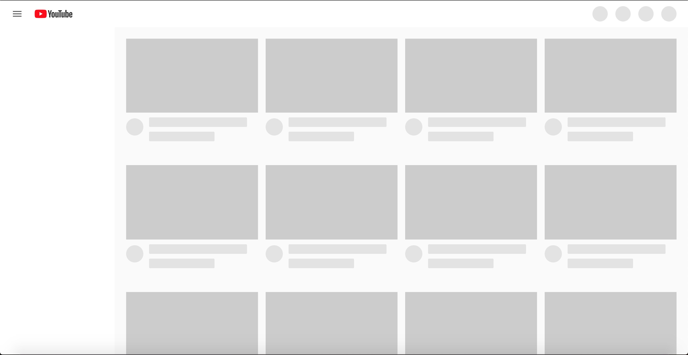
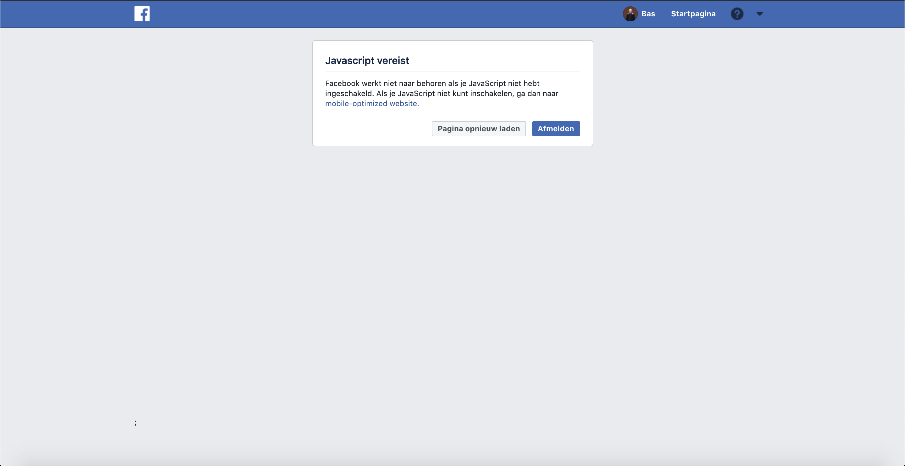
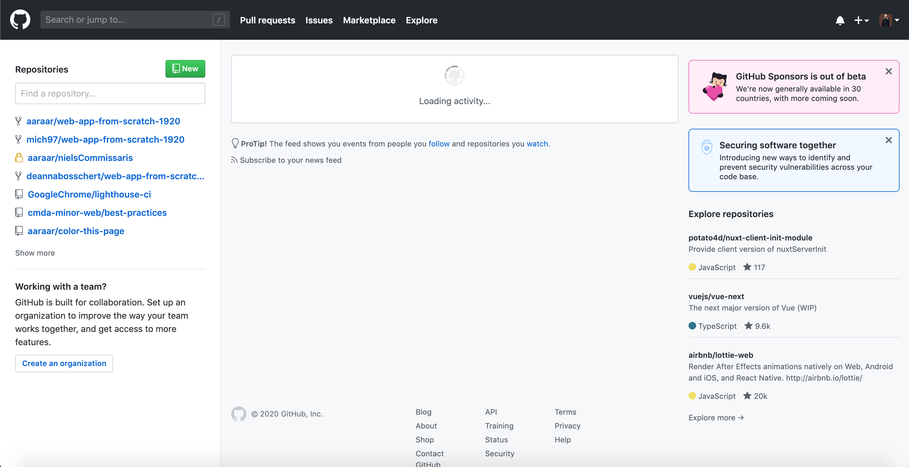
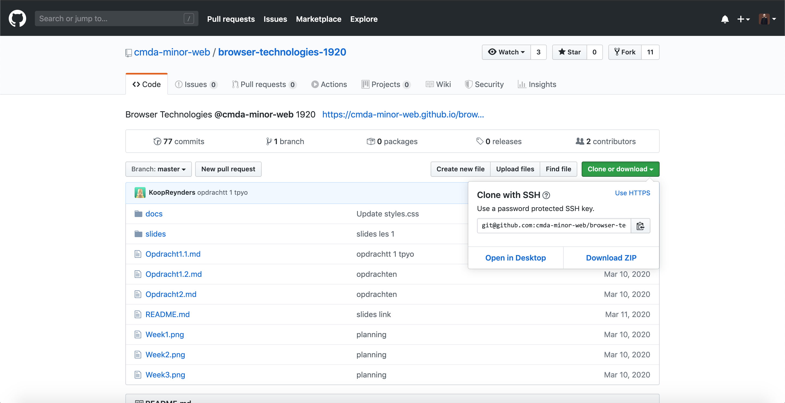
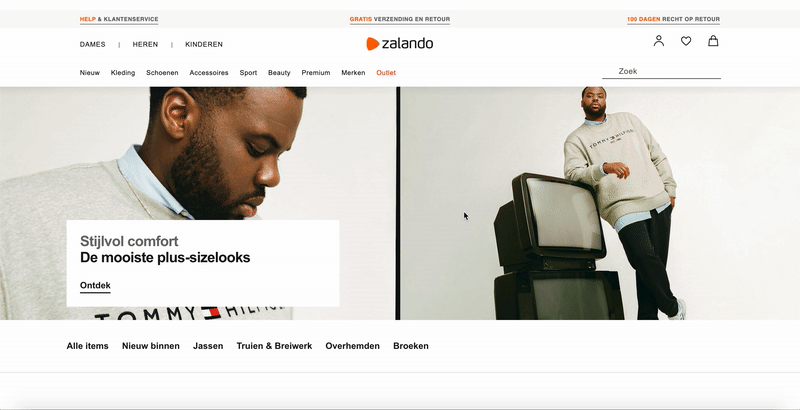
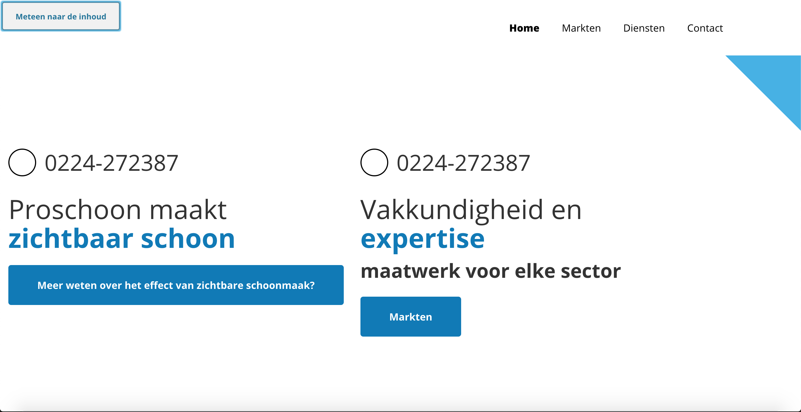

# Breek het web
## Hoe reageert het web zonder Javascript en zonder trackpad/muis
### Geen JS
Veel websites tegenwoordig gebruiken Javascript voor het grootste deel van hun interactie.
Kijk bijvoorbeeld naar een site als youtube.

Dit is alles wat je ziet als er geen Javscript beschikbaar is. 
Een skeleton interface waar Javscript eigenlijk alle content aan toe moet gaan voegen.
Omdat ik nu ook zonder muis werk is ook gelijk duidelijk dat er niks op deze pagina daadwerkelijke content heeft om op te focussen,
want met een druk op de tabtoets zit je direct in de URL balk.
 
Een ander voorbeeld, wat iets eleganter is, maar nog steeds onbruikelijk is Facebook die gewoon simpelweg een melding geeft dat je javascript nodig hebt om de pagina te bezoeken.

Sommige websites doen dit heel goed en hebben nou eenmaal functionaliteit waar Javascript voor nodig is, maar de kern functionaliteit werkt nog steeds.

Hier zie je de homepagina van Github als je ingelogd bent. De meeste functionaliteit is beschikbaar, behalve de live feed met activiteit, wat opzich vrij logisch is.
Als je vervolgens een Repo wilt bezoeken en wilt clonen (de kern functionaliteit van een git service), is dit net zo mogelijk als met Javascript.

Het wordt lastig/vervelend als websites wel html serveren maar delen in JS uitvoeren. Bij Zalando bijvoorbeeld wordt een groot deel Server side gerendered,
maar de producten worden met JS opgehaald. Dat creëert onderstaand effect

#### Oplossing
Zoveel mogelijk statische HTML serveren en JS alleen gebruiken wanneer het ect niet anders kan.
Alle content moet beschikbaar zijn zonder JS

### Geen trackpad/muis
Om te laten zien hoe een website werkt zonder muis of trackpad wilde ik graag een voorbeeld laten zien waar ik aan mee heb gewerkt voor een grote wooncorporatie.
Het doel van deze klant was dat de website voor zoveel mogelijk bezoekers beschikbaar zou zijn en zijn er dus door twee instanties accesibility tests op uitgevoerd.
Hier heb ik veel geleerd over accesibility en vooral ook hoe de wensen van een klant elkaar kunnen tegenspreken (we mochten bijvoorbeeld geen grote aanpassingen aan het design maken voor toegankelijkheid, ondanks dat sommige kleur keuzes een zeer slecht contrast hadden).

Gelijk kwam ik erachter dat de kern functionaliteit van de site nog steeds werkt, met mijn JS uitgeschakeld, maar er is alleen weinig te zien aangezien bijna alle afbeeldingen worden ingeladen met JS

Wat je links bovenin het scherm ziet is een toegankelijkheidsfunctie die een gebruiker zonder muis helpt te navigeren. 
Als je met de TAB toets door de focuse van de site heen gaat is dit het eerste element en door op enter te drukken verschuift de focuse direct naar de content zodat je niet het hele navigatie menu door moet.

#### Oplossing
- Tab-index goed instellen voor elk element
- Een eerste tab index met focus die de NAV overslaat en direct naar de content gaat
- Duidelijke aanduiding waar de focus is met CSS