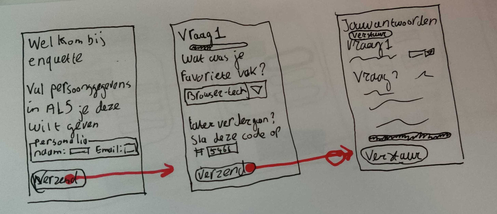
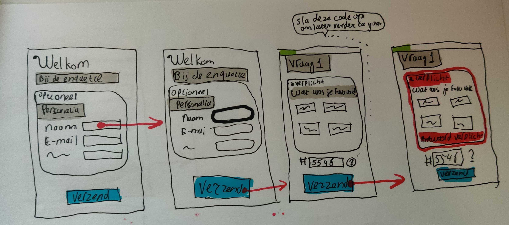
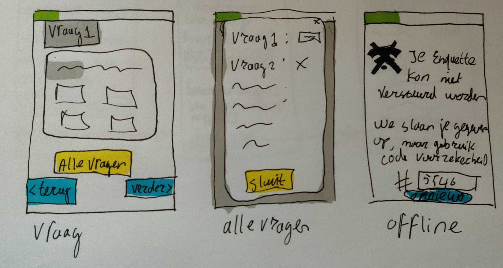

# Progressive enhanced case
## Usecase
Ik wil een enquete kunnen invullen over de minor Web Development, met verschillende antwoord mogelijkheden. Als ik de enquete niet afkrijg, wil ik later weer verder gaan met waar ik ben gebleven.

## Idee
- Een enquete die per stap/vraag een eigen pagina heeft. Op het moment dat je begint maakt de server een hash aan die je kan kopieren/onthouden zodat je later altijd terug kan
- Een progress bar per pagina laat zien hoe ver je bent.
- Met JS wordt het een SPA die je makkelijk heen en weer laat gaan en local storage gebruikt zodat je de hash niet hoeft te onthouden

## Wireflow
###Functional

### Usable

### Pleasurable toevoegingen
