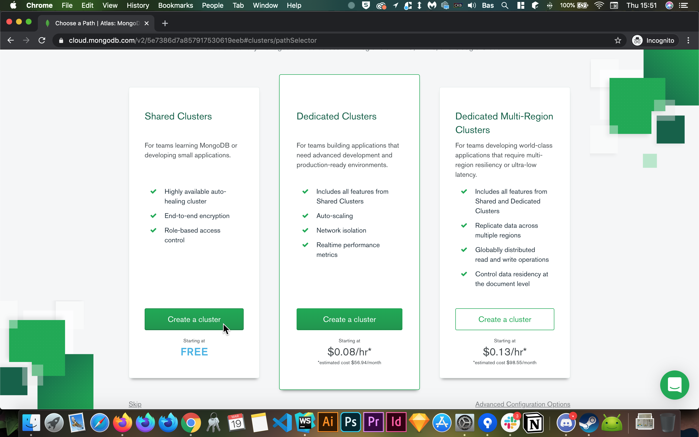
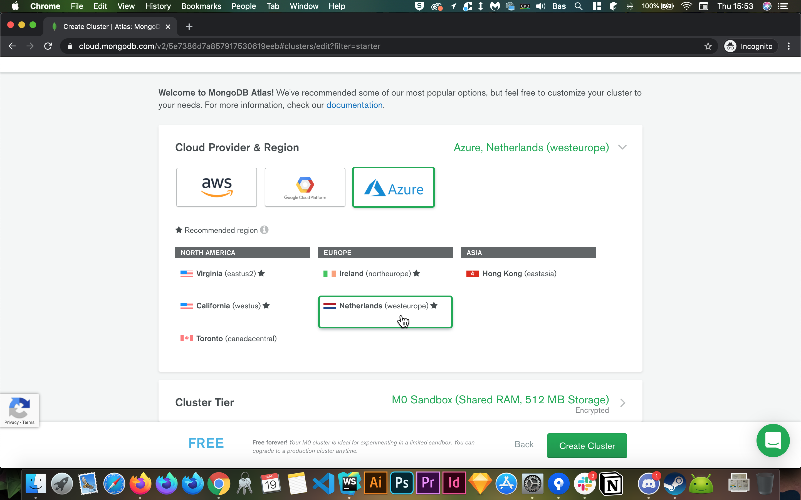
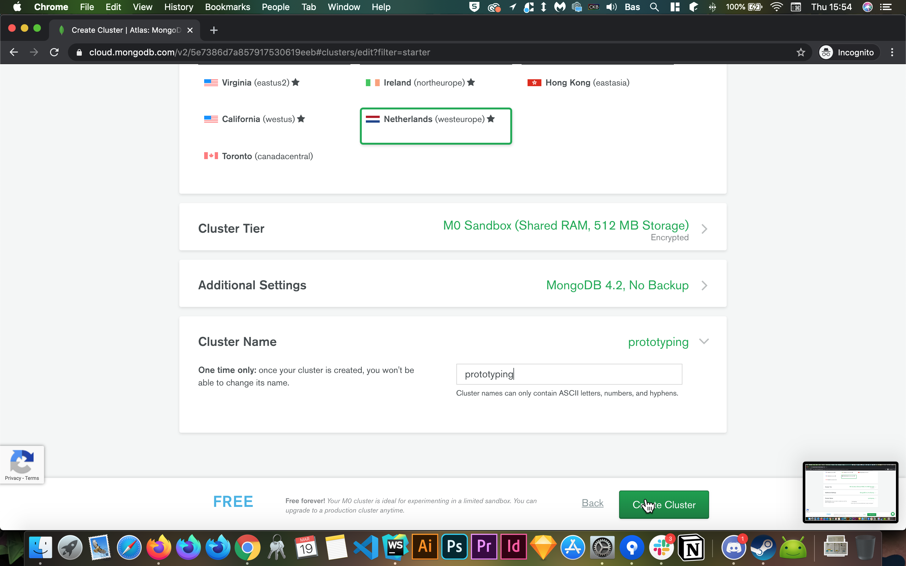
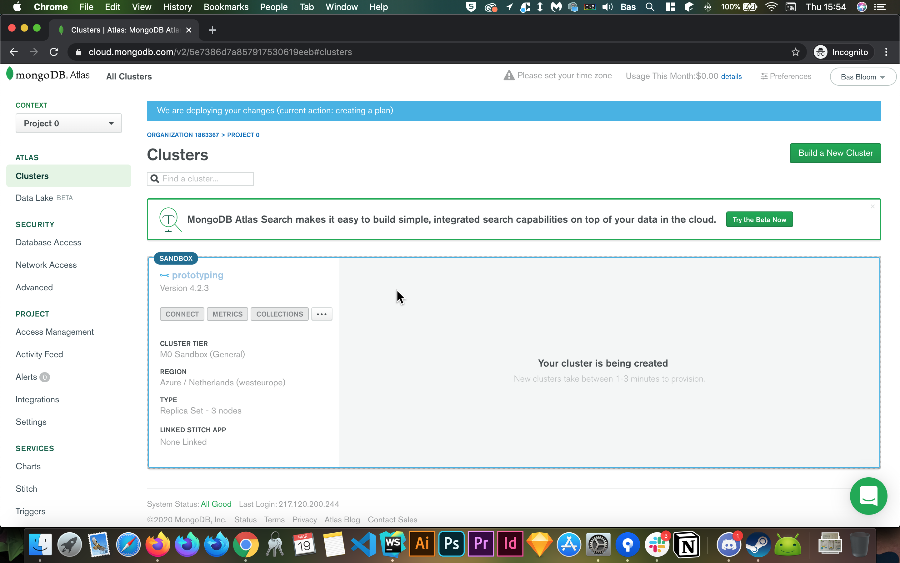
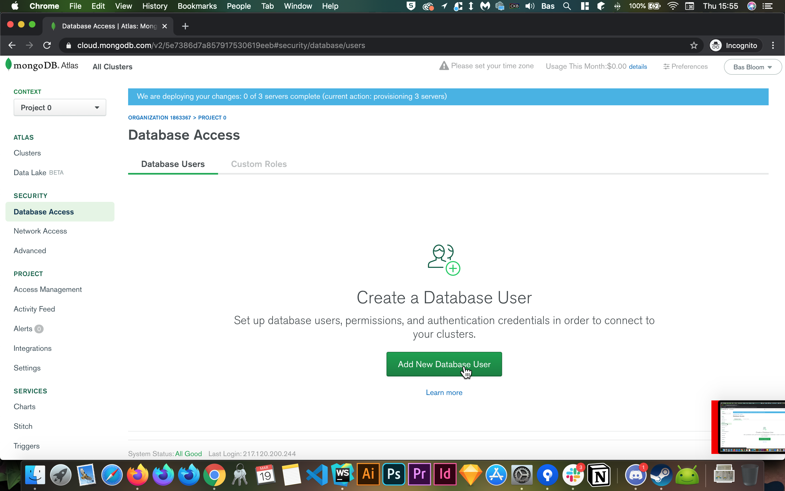
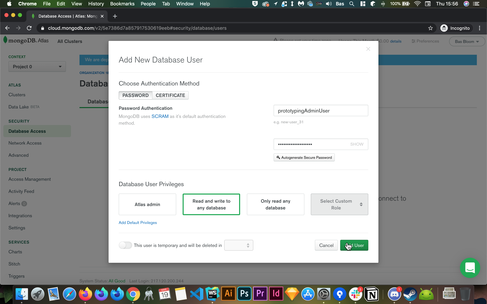
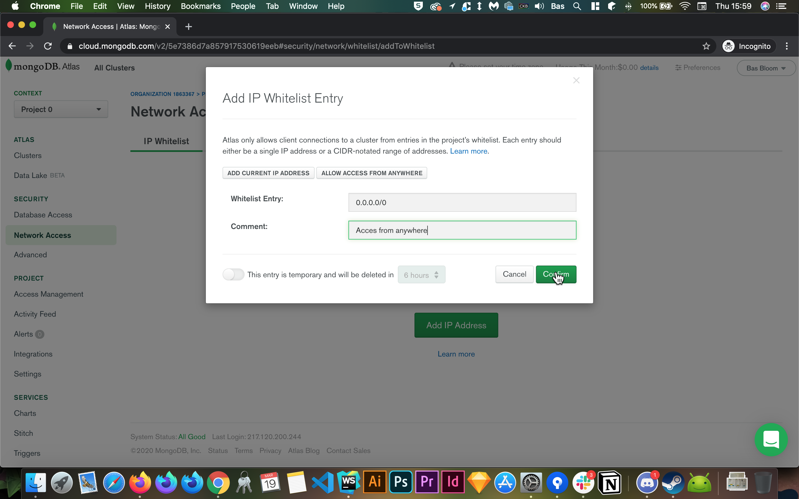
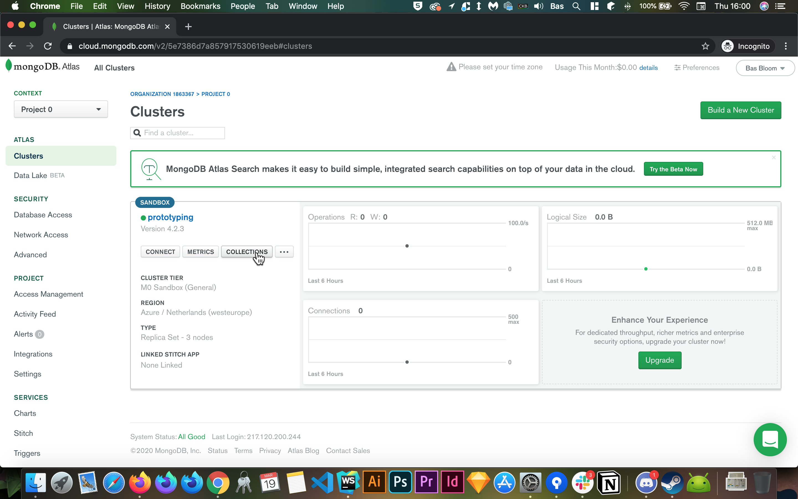
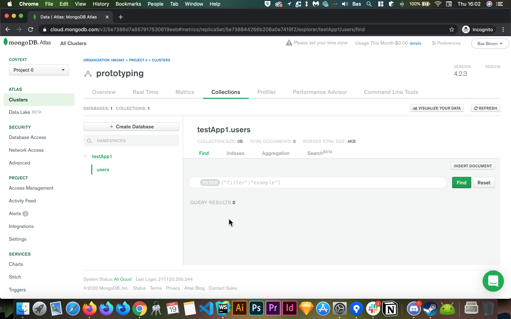

# Werken met Data in je webapplicatie
Als je wel eens een webapplicatie hebt gebouwd waarbij je gebruikers data konden invoeren of waarbij je zelf data uit een
externe bron haalde, dan heb je waarschijnlijk wel eens geprobeerd om deze data ergens op te slaan (of het nou gelukt is of niet).
Data opslaan op je server is iets wat je op verschillende manieren kunt doen, maar bij een applicatie die werkt met meerdere
databronnen is het gebruik van een database vaak de meest efficiëntste en uiteindelijk makkelijkste manier.
In dit artikel zal ik verschillende manieren bespreken voor het opslaan van data en waarom je deze zou gebruiken.

## Waar werken we mee
Het is tegenwoordig heel gemakkelijk om snel een node applicatie te bouwen en veel nieuwe maar ook huidige webdevelopers
werken met deze technologie. Om die reden zal dit artikel zich vooral focussen op het gebruik van een Node/Express server.
Als laatste ga ik nog heel even in op het gebruik van externe data in een statische site.

## JSON bestanden opslaan op de server
Veel developers vinden het een beetje eng om een database op te zetten voor een applicatie en dat is ook niet zo gek want
de theorie achter databases, hoe deze werken en hoe je deze het efficiënst en veiligst gebruikt is vrij ingewikkeld.
Veel developers beginnen daarom, om de database te ontkomen, met het wegschrijven van JSON bestanden (of andere data-types)
naar hun server opslag. Het grote nadeel hieraan is, is dat je eigenlijk zelf een soort 'database' maakt met alle performance en veiligheids issues vandien.
Aangezien je server de opslag moet uitvoeren zonder optimalisatie is dit niet altijd even snel en heb je genoeg ruimte op de server nodig.
Gelukkig zijn JSON bestanden niet snel heel groot en is node heel sterk met het verwerken van deze bestanden, daarnaast 
is dit makkelijk om te begrijpen zodat je snel kan prototypen.

### Hoe doe je dit
#### FileSystem
Om JSON bestanden op te slaan vanuit een node process, heeft node zijn fileserver module nodig, deze zit standaard in node,
je moet hem alleen requiren in je applicatie d.m.v.    
`const fs = require('fs-extra');`    
Er zijn een aantal NPM packages die je goed kan gebruiken bij het wegschrijven van data, bijvoorbeeld om mappen aan te maken en verwijderen.
Om deze gemakkelijk te integreren gebruik ik zelf liever altijd de 'fs-extra' package. Hierin zit de standaard 'fs' module + wat extra modules.
Hiervoor hoef je dus alleen `npm install fs-extra` of `yarn add fs-extra` uit te voeren in de root van je project en ipv bovenstaande import
te gebruiken, gebruik je nu:    
`const fs = require('fs-extra');`    

### Write & Check functies
Voor makkelijk gebruik van de filesystem, schrijf ik zelf graag de volgende functies:
- writeToFile
    * Kan een bestand wegschrijven
    * writeToFile i.pv. writeFile, aangezien writeFile een fs functie is, dus deze abstraheer ik graag een klein beetje
- checkFile
    * Kan controleren of een bestand is aangemaakt (en eventueel kan valideren)
- writeToJson
    * Kan een JSON bestand wegschrijven met behulp van writeFile en checkFile
- getJson
    * Kan een JSON bestand ophalen

```javascript
function writeToJson( writePath, dataPromise ) {
    return new Promise ( ( resolve, reject ) => {
        dataPromise ().then ( ( json ) => {
            writeToFile ( writePath, JSON.stringify ( json ), ( err ) => {
                if ( err ) return console.error ( err );
                checkFile ( writePath ).then ( () => resolve () ).catch ( err => reject ( err ) )
            } );
        } );
    } )
}

function getJson(writePath) {
    return new Promise ( ( resolve, reject ) => {
        fs.readFile ( writePath, 'utf8', ( err, data ) => {
            if ( err ) reject ( err );
            resolve ( JSON.parse ( data ) );
        } )
    } )
}

function writeToFile( writePath, data, cb ) {
    fs.mkdirp ( path.dirname ( writePath ), err => {
        if ( err ) console.error ( err );
        fs.writeFile ( writePath, data, { flag: 'w' }, cb )
            .then(console.log(`📪 File written to ${writePath}`))
    } );
}

function checkFile( writePath, mode = 'json' ) {
    return new Promise ( ( resolve, reject ) => {
        fs.readFile ( writePath, 'utf-8', ( err, data ) => {
            if ( err ) reject ( err );
            if ( mode === 'json' ) console.log ( `🔍 File verified at ${ writePath }` );
            resolve ( data );
        } );
    } )
}
```
#### Wat gebeurd hier
Om deze pattern toe te passen, gebruik je simpelweg writeToJson(); met als eerste parameter waar het bestand moet komen te staan
en als tweede parameter een promise die resolved met de data die je wilt schrijven (ofwel uit een database of een API).
- De dataPromise wordt afgewacht
- De data uit de promise en de writePath worden meegegeven aan de writeToFile functie
- Als de writeToFile klaar is, checkt checkFile of het bestand echt bestaat.

#### mkdirp
`mkdirp` is een package die eigenlijk hetzelfde doet als het unix command `mkdir -p`. Wat het doet is eigenlijk simpelweg,
maak de map waar het bestand in moet komen aan en alle parent directories, mits deze bestanden nog niet bestaan. Dit zorgt
er dus voor dat je bestand altijd geschreven kan worden naar de map die je aangeeft, als je de rechten hiervoor hebt (wat node meestal heeft als je het juist installeerd).

### Gebruik
Je zou writeToFile en checkFile ook los kunnen gebruiken voor andere bestandstypes, daarom is het zo abstract mogelijk en zul je dus bij het aanroepen nog een bestandstype mee moeten geven
HAls je data weg wilt schrijven naar een JSON bestand doe je het volgende: 
```javascript
const path = require( 'path' );
const writePath = path.join( __dirname, 'data' );
function dataPromise( url ) {
    return new Promise ( ( resolve, reject ) => {
            fetch ( url,
                {
                    method: 'GET',
                    headers: {
                        'X-Requested-With': 'XMLHttpRequest'
                    }
                } )
                .then ( ( res ) => {
                    if ( res.ok ) return res.json ();
                    else reject ( res );
                } )
                .then ( json => {
                    resolve(json)
                } )
        } )
}
writeToJson ( writePath, dataPromise() )
        .catch( err => {
            console.error( err )
        } )
        .then( () => {
            // Wat je er eventueel na wilt doen, bijv een response sturen
        } )
```
* Ik maak hierbij nog gebruik van de path module om het gehele path naar de server.js te krijgen zodat de server geen fout
kan maken over het path waar hij naartoe moet schrijven

Als ik nu de JSON op wil halen roep ik simpelweg de volgende functie aan
```javascript
getJson( writePath ).then( data => {
    // Doe met de data wat je wilt
} )
```

## MongoDB verbinden aan je express server
Bij het gebruik van een express server, maak ik eigenlijk liever altijd gebruik van mongoDB, vooral als ik snel moet prototypen.
Als het een groter project is met meerdere developers, is er hopelijk ook een backender die een database opzet met documentatie van de juiste
patterns voor het gebruik ervan, maar neem aan dat we als frontenders nu lekker aab het prototypen zijn.
Om een simpele mongoDB op te zetten, maak ik zelf altijd gebruik van hun eigen [MongoDB Atlas Cloud dienst](https://mongodb.com).

Het fijne aan MongoDB als Javascript developer is dat het gebruik maakt van JSON syntax voor het opslaan van data.
Om te beginnen zul je een account aan moeten maken en ik loop je even door de stappen heen, mocht het verwarrend zijn.
Dit hoef je gelukkig maar 1 keer te doen en daarna kun je het voor altijd gebruiken.
Heb je al een account, ga dan door naar [Gebruik](#gebruik)
1. Registreer een account
2. Gelijk moet je een keuze maken tussen soorten 'clusters', dit zijn de omgevingen waarin je database gaat leven, we kiezen voor nu simpelweg de `Shared Clusters` optie, want die is __gratis__


3. Kies een cloud provider waar MongoDB je database op gaat hosten, ik raad aan dat je Microsoft Azure kiest als je in Nederland zit, aangezien zij op het moment de enige gratis server in Nederland aanbieden


4. Kies een duidelijke cluster naam en klik op create cluster


5. Je ziet nu dat je cluster wordt aangemaakt op de server, dit kan even duren dus we lopen eerst door wat andere stappen heen


6. Maak een database user aan onder het tabje Security > Database Acces


7. Zorg dat dit account de readWriteAnyDatabase rechten heeft


8. Ga naar Security > Network Acces en druk op `Add IP Adress` en vervolgens op `ALLOW ACCES FROM ANYWHERE` om onhandige foutmeldingen te voorkomen.



### Gebruik
Als je een cluster hebt zul je nog even een database moeten aanmaken in je cluster voor het project waar je aan werkt.
1. Klik op `COLLECTIONS`


2. klik of op `Create new Database` of `Add My Own Data` als dit je eerste database is.
3. Kies een naam voor de database en de eerste collectie en druk op confirm
4. Je ziet nu dat we een lege database hebben



Het handige aan deze dienst is dat ze gelijk een mooie voorbeeld code geven die je kan gebruiken om je server aan je database te koppelen.
Hier maken we zo nog even kleine aanpassingen aan, maar ga terug naar de cluster overzicht.
1. Klik op `CONNECT`
2. Klik op `Connect you application`
3. Kies je Node versie (waarschijnlijk wel `3.0 or later`) en wissel naar de tab `Full Driver Example`
4. Kopieer deze code en plak het in je express server
5. Installeer de mongodb package d.m.v. `npm install mongodb` of `yarn add mongodb`
6. Pas de code even aan als volgt:
    * Verander `<password>` naar process.env.MONGODB_PASSWORD zodat je het kan pushen naar git
    * Voeg `useUnifiedTopology: true` aan de mongoClient constructor toe
    * Verwijder `client.close();`
    * Verander de database naam in zowel de URL (staat nu op `test`) en in de `const client` declaratie
    * Pas de collectie in diezelfde declaratie aan naar de collectie die je gebruikt

Ik heb hiervoor zelf een stukje herbruikbare code die je zelf ook kan gebruiken als je de goede .env variabelen instelt
```javascript
require('dotenv').config();
const assert = require('assert');
const MongoClient = require('mongodb').MongoClient;
const uri = `mongodb+srv://${process.env.MONGODB_USER}:${process.env.MONGODB_PASSWORD}@${process.env.MONGODB_SERVER}/test?retryWrites=true&w=majority`;
const client = new MongoClient(uri, {useNewUrlParser: true, useUnifiedTopology: true});
let database;

client.connect((err, db) => {
    assert.strictEqual(null, err);
    database = db;
});

// Returns DB object when called
module.exports.get = function() {
    return database;
}
```

#### Data toevoegen
Als je instellingen kloppen, kan je dus net als ik veel code hergebruiken en is het opzetten van een nieuw project vrij snel en simpel.
Zoals je ziet wordt er onderaan het bestand een database object geexporteerd. Deze variabele kun je dus gebruiken in elke route zolang je het bestand maar importeert. Dit maakt het zo makkelijk modulair.
Met het gebruik van bodyParser kunnen we nu heel simpel de data uit een formulier op een post route wegschrijven naar de database als volgt
```javascript
const database = require('../controllers/db');

app.post('/post', (req, res) => {
const mongo = database.get();
const dataset = mongo.db('strvct').collection('dataset');
dataset.insertOne(
      {
          name: req.body.name // req.body wordt een object dat alle formulier velden bevat onder de property van hun name value
      } )
      .then( () => {
          // Vervolg stap
      } )
    });
});
```
Je kunt de data die je toevoegt makkelijk weer terug zien op mongodb.com bij de juiste database en collectie.

### Data ophalen
Het ophalen is net zo makkelijk.
Ik raad aan om unieke ID's te gebruiken voor het zoeken (deze maakt mongo automatisch aan), maar voor nu zoeken we even op een naam.
De reden om met ID's te werken is zodat je nooit 2 dezelfde items hebt op een zoek opdracht naar de database (tenzij je dit wilt natuurlijk, maar we willen voor nu even object ophalen)
Ondestaande code zoekt op naar een naam die ingevuld is in het HTML formulier en stuurt het bijbehorende data object terug of een melding dat deze niet bestaat.
```javascript
const database = require('../controllers/db');
const mongo = database.get();
const dataset = mongo.db('strvct').collection('dataset');
dataset.findOne( { name: req.body.name } )
    .then(data => {
        if (data) res.send(data);
        else res.send('No data found')
    })
```
Je kan dit natuurlijk helemaal uitbouwen naar de logica die je nodig hebt zodat je bijvoorbeeld eerst kijkt of iets bestaat dan daarmee iets doet en als het niet bestaat het aanmaakt.
Lees de documentatie van mongoDB goed als je iets wilt doen, of google het, want er zijn waarschijnlijk al 20 andere geweest die hetzelfde hebben geprobeerd.
Een handige methode van mongoDB om te leren is de `update()` of `updateOne()`
